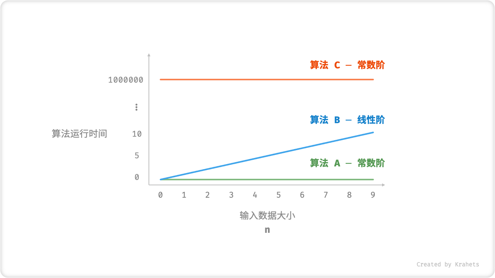
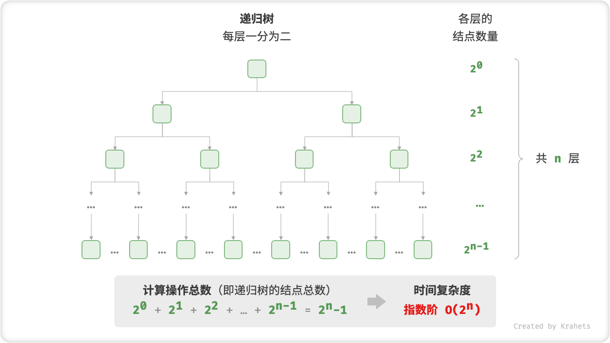
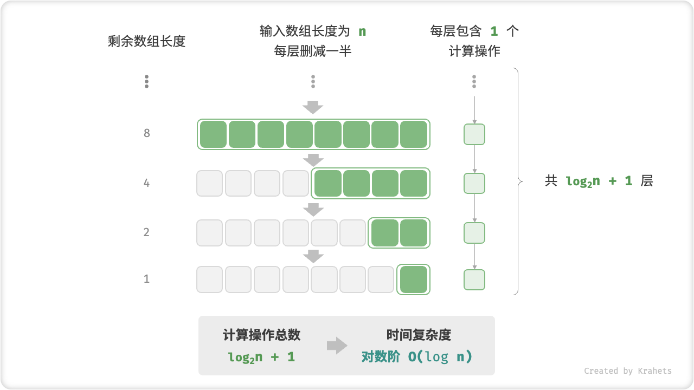
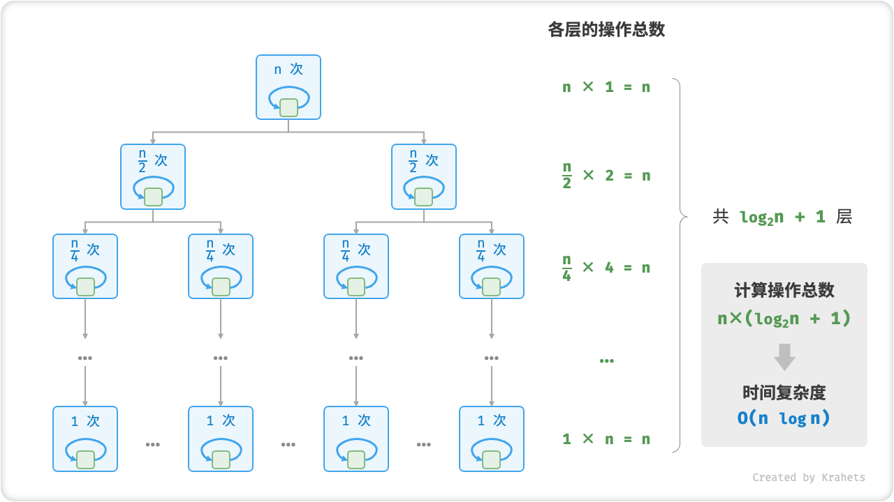
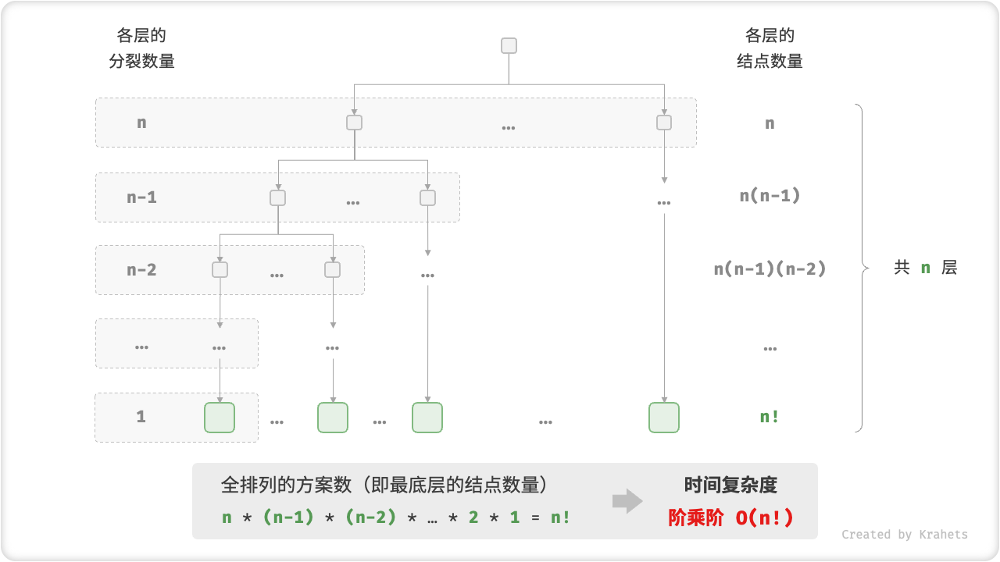

# 算法复杂度分析

可以解决问题的前提下，算法效率则是主要评价维度，包括：

时间效率，即算法的运行速度的快慢。
空间效率，即算法占用的内存空间大小。

数据结构与算法追求“运行速度快、占用内存少”

### 时间复杂度

「时间复杂度分析」采取了不同的做法，其统计的不是算法运行时间，而是 算法运行时间随着数据量变大时的增长趋势 。

“时间增长趋势”这个概念比较抽象，我们借助一个例子来理解。设输入数据大小为 
 ，给定三个算法 A , B , C 。

算法 A 只有1个打印操作，算法运行时间不随着n增大而增长。我们称此算法的时间复杂度为「常数阶」。
算法 B 中的打印操作需要循环 n 次，算法运行时间随着 n 增大成线性增长。此算法的时间复杂度被称为「线性阶」。
算法 C 中的打印操作需要循环 1000000 次，但运行时间仍与输入数据大小 n 无关。因此 C 的时间复杂度和 A 相同，仍为「常数阶」。

```[java]
// 算法 A 时间复杂度：常数阶
void algorithm_A(int n) {
    System.out.println(0);
}
// 算法 B 时间复杂度：线性阶
void algorithm_B(int n) {
    for (int i = 0; i < n; i++) {
        System.out.println(0);
    }
}
// 算法 C 时间复杂度：常数阶
void algorithm_C(int n) {
    for (int i = 0; i < 1000000; i++) {
        System.out.println(0);
    }
}
```



我们将线性阶的时间复杂度记为O(n)

### 推算方法

1.跳过数量与n无关的操作。因为都是常数项，对时间复杂度不产生影响

2.省略所有系数。如：2n次，都可化简为n，系数对时间复杂度不产生影响

3.循环嵌套时使用乘法。

```[java]
void algorithm(int n) {
    int a = 1;  // +0（技巧 1）
    a = a + n;  // +0（技巧 1）
    // +n（技巧 2）
    for (int i = 0; i < 5 * n + 1; i++) {
        System.out.println(0);
    }
    // +n*n（技巧 3）
    for (int i = 0; i < 2 * n; i++) {
        for (int j = 0; j < n + 1; j++) {
            System.out.println(0);
        }
    }
}
```

### 判断渐近上界

**时间复杂度由多项式 T(n) 中最高阶的项来决定**。

这是因为在 n 趋于无穷大时，最高阶的项将处于主导作用，其它项的影响都可以被忽略。

### 常见类型

设输入数据大小为 n ，常见的时间复杂度类型有（从低到高排列）

O(1)<O(logn)<O(n)<O(nlogn)<O(n^2)<O(2^n)<O(n!)

常数阶<对数阶<线性阶<线性对数阶<平方阶<指数阶<阶乘阶


#### 常数阶

常数阶的操作数量与输入数据大小 n 无关，即不随着 n 的变化而变化。

对于以下算法，无论操作数量 size 有多大，只要与数据大小 n 无关，时间复杂度就仍为O(1)。

```[java]
/* 常数阶 */
int constant(int n) {
    int count = 0;
    int size = 100000;
    for (int i = 0; i < size; i++)
        count++;
    return count;
}
```

#### 线性阶

线性阶的操作数量相对输入数据大小成线性级别增长。线性阶常出现于单层循环。

```[java]
/* 线性阶 */
int linear(int n) {
    int count = 0;
    for (int i = 0; i < n; i++)
        count++;
    return count;
}
```

遍历数组」和「遍历链表」等操作，时间复杂度都为 O(n) ，其中 n 为数组或链表的长度。

#### 平方阶

平方阶的操作数量相对输入数据大小成平方级别增长。平方阶常出现于嵌套循环，外层循环和内层循环都为 O(n) ，总体为O(n^2) 。

```[java]
/* 平方阶 */
int quadratic(int n) {
    int count = 0;
    // 循环次数与数组长度成平方关系
    for (int i = 0; i < n; i++) {
        for (int j = 0; j < n; j++) {
            count++;
        }
    }
    return count;
}
```

以「冒泡排序」为例，外层循环 n-1 次，内层循环 n-1,n-2,...,2,1 次，平均为 n/2 次，因此时间复杂度为O(n^2)

```[java]
/* 平方阶（冒泡排序） */
int bubbleSort(int[] nums) {
    int count = 0;  // 计数器
    // 外循环：待排序元素数量为 n-1, n-2, ..., 1
    for (int i = nums.length - 1; i > 0; i--) {
        // 内循环：冒泡操作
        for (int j = 0; j < i; j++) {
            if (nums[j] > nums[j + 1]) {
                // 交换 nums[j] 与 nums[j + 1]
                int tmp = nums[j];
                nums[j] = nums[j + 1];
                nums[j + 1] = tmp;
                count += 3;  // 元素交换包含 3 个单元操作
            }
        }
    }
    return count;
}
```

#### 指数阶

指数阶增长得非常快，在实际应用中一般是不能被接受的。若一个问题使用「暴力枚举」求解的时间复杂度是 O(2^n) ，那么一般都需要使用「动态规划」或「贪心算法」等算法来求解。

```[java]
/* 指数阶（循环实现） */
int exponential(int n) {
    int count = 0, base = 1;
    // cell 每轮一分为二，形成数列 1, 2, 4, 8, ..., 2^(n-1)
    for (int i = 0; i < n; i++) {
        for (int j = 0; j < base; j++) {
            count++;
        }
        base *= 2;
    }
    // count = 1 + 2 + 4 + 8 + .. + 2^(n-1) = 2^n - 1
    return count;
}
```



在实际算法中，指数阶常出现于递归函数。例如以下代码，不断地一分为二，分裂 n 次后停止。

```[java]
/* 指数阶（递归实现） */
int expRecur(int n) {
    if (n == 1) return 1;
    return expRecur(n - 1) + expRecur(n - 1) + 1;
}
```

#### 对数阶

对数阶与指数阶正好相反，后者反映“每轮增加到两倍的情况”，而前者反映“每轮缩减到一半的情况”。对数阶仅次于常数阶，时间增长得很慢，是理想的时间复杂度。

对数阶常出现于「二分查找」和「分治算法」中，体现“一分为多”、“化繁为简”的算法思想。

设输入数据大小为 n ，由于每轮缩减到一半，因此循环次数是  ，即 log<sub>2</sub>n 的反函数。

```[java]
/* 对数阶（循环实现） */
int logarithmic(float n) {
    int count = 0;
    while (n > 1) {
        n = n / 2;
        count++;
    }
    return count;
}
```



与指数阶类似，对数阶也常出现于递归函数。以下代码形成了一个高度为 log<sub>2</sub> n 的递归树。

```[java]
/* 对数阶（递归实现） */
int logRecur(float n) {
    if (n <= 1) return 0;
    return logRecur(n / 2) + 1;
}
```

#### 线性对数阶

线性对数阶常出现于嵌套循环中，两层循环的时间复杂度分别为 O(log n) 和 O(n) 。

主流排序算法的时间复杂度都是 O(n log n) ，例如：快速排序、归并排序、堆排序等。

```[java]
/* 线性对数阶 */
int linearLogRecur(float n) {
    if (n <= 1) return 1;
    int count = linearLogRecur(n / 2) + 
                linearLogRecur(n / 2);
    for (int i = 0; i < n; i++) {
        count++;
    }
    return count;
}
```



#### 阶乘阶

阶乘阶对应数学上的「全排列」。即给定 n 个互不重复的元素，求其所有可能的排列方案，则方案数量为

n!=n x (n-1) x (n-2) x ... x 2 x 1

阶乘常使用递归实现。例如以下代码，第一层分裂出 n 个，第二层分裂出 n-1 个，…… ，直至到第 n 层时终止分裂。

```[java]
/* 阶乘阶（递归实现） */
int factorialRecur(int n) {
    if (n == 0) return 1;
    int count = 0;
    // 从 1 个分裂出 n 个
    for (int i = 0; i < n; i++) {
        count += factorialRecur(n - 1);
    }
    return count;
}
```



### 最差、最好、平均时间复杂度

某些算法的时间复杂度不是恒定的，而是与输入数据的分布有关。举一个例子，输入一个长度为 n 数组 nums ，其中 nums 由从 1 至 n 的数字组成，但元素顺序是随机打乱的；算法的任务是返回元素 1 的索引。我们可以得出以下结论：

当 nums = [?, ?, ..., 1]，即当末尾元素是 1 时，则需完整遍历数组，此时达到 最差时间复杂度 O(n) ；
当 nums = [1, ?, ?, ...] ，即当首个数字为 1 时，无论数组多长都不需要继续遍历，此时达到 最佳时间复杂度 Ω(1) ；
「函数渐近上界」使用大 O 记号表示，代表「最差时间复杂度」。与之对应，「函数渐近下界」用 Ω 记号（Omega Notation）来表示，代表「最佳时间复杂度」。

```[java]
/* 生成一个数组，元素为 { 1, 2, ..., n }，顺序被打乱 */
int[] randomNumbers(int n) {
    Integer[] nums = new Integer[n];
    // 生成数组 nums = { 1, 2, 3, ..., n }
    for (int i = 0; i < n; i++) {
        nums[i] = i + 1;
    }
    // 随机打乱数组元素
    Collections.shuffle(Arrays.asList(nums));
    // Integer[] -> int[]
    int[] res = new int[n];
    for (int i = 0; i < n; i++) {
        res[i] = nums[i];
    }
    return res;
}

/* 查找数组 nums 中数字 1 所在索引 */
int findOne(int[] nums) {
    for (int i = 0; i < nums.length; i++) {
        // 当元素 1 在数组头部时，达到最佳时间复杂度 O(1)
        // 当元素 1 在数组尾部时，达到最差时间复杂度 O(n)
        if (nums[i] == 1)
            return i;
    }
    return -1;
}
```

