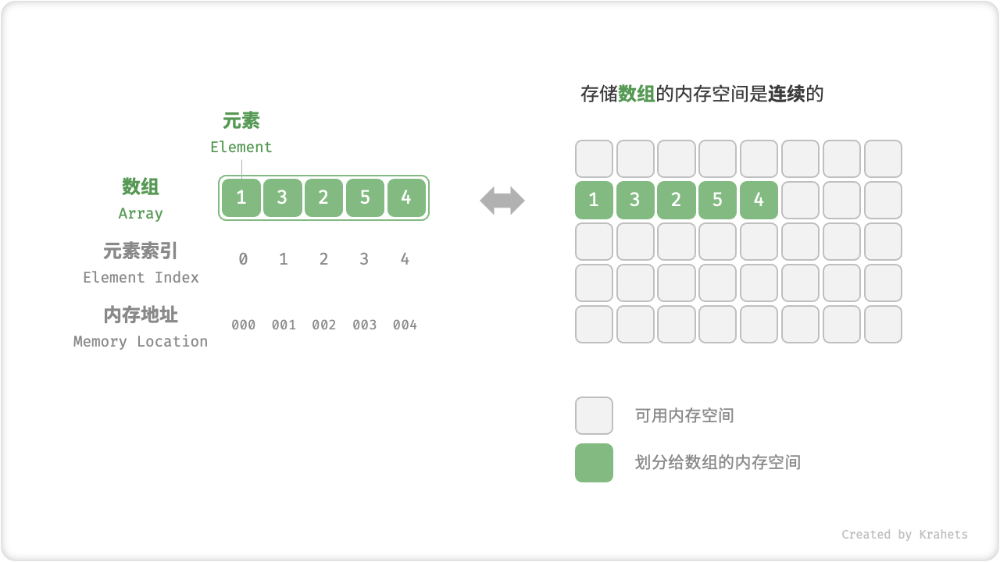
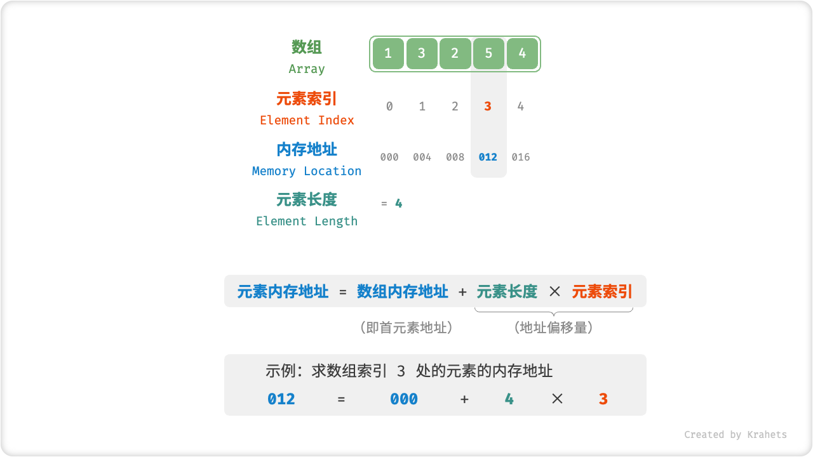
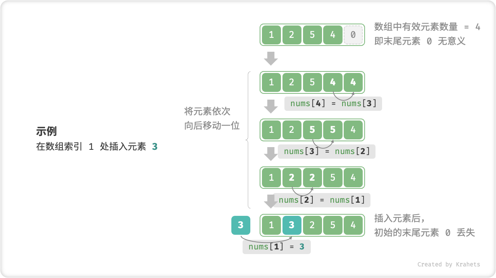

# 数组与链表

「数组 Array」是一种将 **相同类型元素** 存储在 **连续内存空间** 的数据结构，将元素在数组中的位置称为元素的「索引 Index」。



**数组初始化**。一般会用到无初始值、给定初始值两种写法，可根据需求选取。在不给定初始值的情况下，一般所有元素会被初始化为默认值 0 。

```[java]/* 初始化数组 */
int[] arr = new int[5]; // { 0, 0, 0, 0, 0 }
int[] nums = { 1, 3, 2, 5, 4 };
```

### 数组优点

**在数组中访问元素非常高效**。这是因为在数组中，计算元素的内存地址非常容易。给定数组首个元素的地址、和一个元素的索引，利用以下公式可以直接计算得到该元素的内存地址，从而直接访问此元素。



元素内存地址 = 数组内存地址 + 元素长度 * 元素索引

elementAddr = firtstElementAddr + elementLength * elementIndex

**为什么数组元素索引从 0 开始编号？** 根据地址计算公式，**索引本质上表示的是内存地址偏移量**，首个元素的地址偏移量是 0 ，那么索引是 0 也就很自然了。

访问元素的高效性带来了许多便利。例如，我们可以在 O(1) 时间内随机获取一个数组中的元素。

```[java]/* 随机返回一个数组元素 */
int randomAccess(int[] nums) {
    // 在区间 [0, nums.length) 中随机抽取一个数字
    int randomIndex = ThreadLocalRandom.current().nextInt(0, nums.length);
    // 获取并返回随机元素
    int randomNum = nums[randomIndex];
    return randomNum;
}
```

### 数组缺点

**数组在初始化后长度不可变**。由于系统无法保证数组之后的内存空间是可用的，因此数组长度无法扩展。而若希望扩容数组，则需新建一个数组，然后把原数组元素依次拷贝到新数组，在数组很大的情况下，这是非常耗时的。

```[java]
/* 扩展数组长度 */
int[] extend(int[] nums, int enlarge) {
    // 初始化一个扩展长度后的数组
    int[] res = new int[nums.length + enlarge];
    // 将原数组中的所有元素复制到新数组
    for (int i = 0; i < nums.length; i++) {
        res[i] = nums[i];
    }
    // 返回扩展后的新数组
    return res;
}
```

**数组中插入或删除元素效率低下**。如果我们想要在数组中间插入一个元素，由于数组元素在内存中是“紧挨着的”，它们之间没有空间再放任何数据。因此，我们不得不将此索引之后的所有元素都向后移动一位，然后再把元素赋值给该索引。



```[java]/* 在数组的索引 index 处插入元素 num */
void insert(int[] nums, int num, int index) {
    // 把索引 index 以及之后的所有元素向后移动一位
    for (int i = nums.length - 1; i > index; i--) {
        nums[i] = nums[i - 1];
    }
    // 将 num 赋给 index 处元素
    nums[index] = num;
}
```

删除元素也是类似，如果我们想要删除索引 i 处的元素，则需要把索引 i 之后的元素都向前移动一位。值得注意的是，删除元素后，原先末尾的元素变得“无意义”了，我们无需特意去修改它。

```[java]/* 删除索引 index 处元素 */
void remove(int[] nums, int index) {
    // 把索引 index 之后的所有元素向前移动一位
    for (int i = index; i < nums.length - 1; i++) {
        nums[i] = nums[i + 1];
    }
}
```

总结来看，数组的插入与删除操作有以下缺点：

- **时间复杂度高**：数组的插入和删除的平均时间复杂度均为 O(n) ，其中 n 为数组长度。
- **丢失元素**：由于数组的长度不可变，因此在插入元素后，超出数组长度范围的元素会被丢失。
- **内存浪费**：我们一般会初始化一个比较长的数组，只用前面一部分，这样在插入数据时，丢失的末尾元素都是我们不关心的，但这样做同时也会造成内存空间的浪费。

### 数组常用操作

索引for循环，增强for循环

### 数组典型应用

**随机访问**。如果我们想要随机抽取一些样本，那么可以用数组存储，并生成一个随机序列，根据索引实现样本的随机抽取。

**二分查找**。例如前文查字典的例子，我们可以将字典中的所有字按照拼音顺序存储在数组中，然后使用与日常查纸质字典相同的“翻开中间，排除一半”的方式，来实现一个查电子字典的算法。

**深度学习**。神经网络中大量使用了向量、矩阵、张量之间的线性代数运算，这些数据都是以数组的形式构建的。数组是神经网络编程中最常使用的数据结构。

